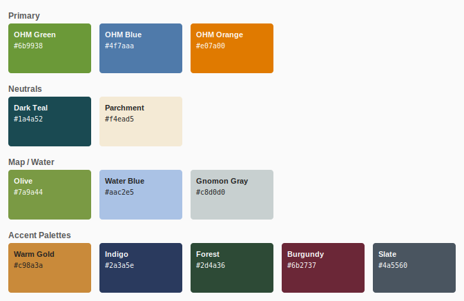
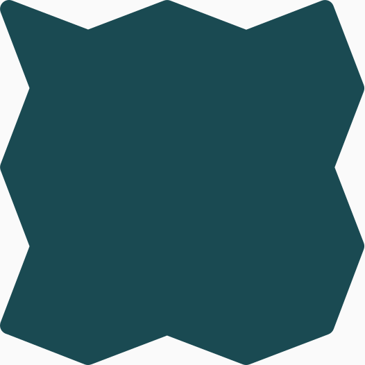
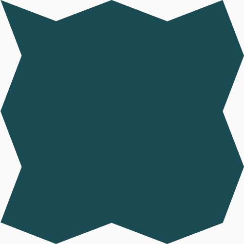
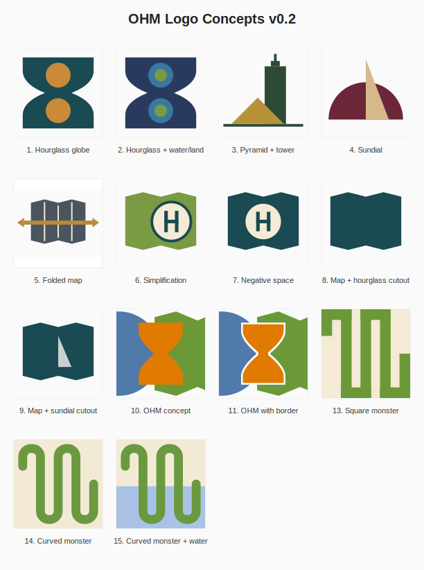
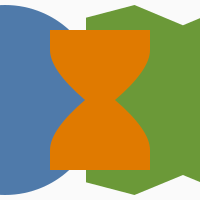
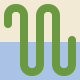
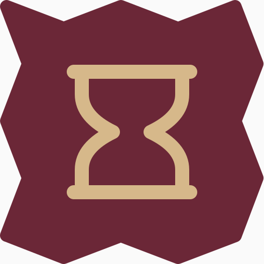
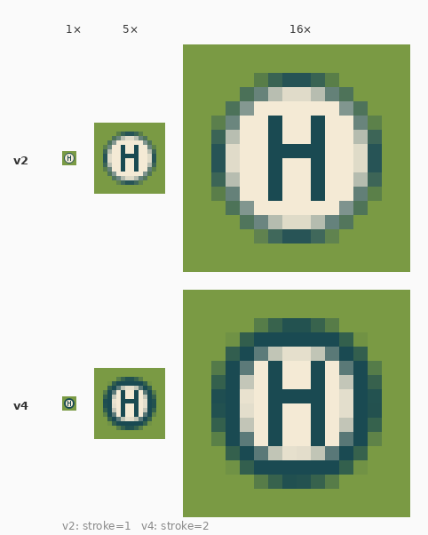

# OpenHistoricalMap — Icon Concepts Design Brief

**[← OHM Logo Refresh Concepts preview gallery](https://openhistoricalmap.github.io/ohm-creative/)**

**Version:** 0.2 (exploration set)  
**Date:** May 2026  
**Project:** OpenHistoricalMap (OHM) — [openhistoricalmap.org](https://openhistoricalmap.org)

---

## 1. Project Context

OpenHistoricalMap is an open, collaborative platform for mapping the world as it existed at any
point in time. It is a sibling project to OpenStreetMap (OSM), sharing its open-data ethos,
community governance, and technical infrastructure. The OHM icon set must:

- Signal a clear family connection to OpenStreetMap
- Introduce themes of **time, history, and cartography** that distinguish OHM from OSM
- Scale from 16×16-pixel favicons to print-resolution SVG without loss of legibility
- Feel contemporary but carry subtle visual cues of historical map-making tradition

---

## 2. Design Principles

### 2.1 OSM Compatibility
OHM's UI inherits OSM's system sans-serif font stack. Any wordmark or icon should feel at home
alongside OSM's visual language — clean, legible, neutral — without being identical to it.

### 2.2 Temporal Duality
Every icon concept should express the idea of **time alongside geography**. Historical maps are
about WHERE things were and WHEN. The strongest concepts find a way to encode both dimensions
in a single, simple form.

### 2.3 Favicon First
All icons are designed to work at 16×16 pixels. A concept that doesn't read at favicon size is
not viable. Icons were evaluated at every stage across five sizes: 16px, 32px, 100px, 128px,
and at 5× nearest-neighbor pixel magnification.

### 2.4 Open-Source Alignment
All typefaces, SVG constructions, and derivative silhouettes use open-source or openly-licensed
source material. The OTM and PDM silhouettes derive from open-licensed logos.

---

## 3. Color System

The color palette is organized into four groups. All values are used consistently across
the concept set.

### Primary Tricolor (OHM Concept)
| Role | Color | Hex |
|------|-------|-----|
| Map silhouette | OHM Green | `#6b9938` |
| Circle / globe | OHM Blue | `#4f7aaa` |
| Hourglass | OHM Orange | `#e07a00` |

### Neutrals
| Role | Color | Hex |
|------|-------|-----|
| Dark background / outlines | Dark Teal | `#1a4a52` |
| Light fill / parchment | Parchment | `#f4ead5` |

### Map Family
| Role | Color | Hex |
|------|-------|-----|
| Map / land areas | Olive | `#7a9a44` |
| Water backgrounds | Water Blue | `#aac2e5` |
| Sundial gnomon overlay | Gnomon Gray | `#c8d0d0` |

### Accent Palettes (per-concept)
Each concept in the exploration set uses a dedicated palette pair drawn from the accent group:
Warm Gold `#c98a3a`, Indigo `#2a3a5e`, Forest `#2d4a36`, Burgundy `#6b2737`, Slate `#4a5560`.

---

## 4. Map Silhouette Language

The **folded map** is OHM's primary shape vocabulary. It reads simultaneously as:
- A paper map folded open (cartography)
- A shape that suggests depth and layering (historical strata)
- A document or artifact (archival reference)

Four versions of the silhouette exist (click any to open the file):

&nbsp;&nbsp;&nbsp;
&nbsp;&nbsp;&nbsp;
&nbsp;&nbsp;&nbsp;

| # | Variant | Character | Source |
|---|---------|-----------|--------|
| 1 | [**Canonical**](img/01-canonical-silhouette.svg) | Crisp, precise, 10-vertex polygon | Original, 100×100 viewBox |
| 2 | [**Organic**](img/02-organic-silhouette.svg) | Hand-feel, gently jittered vertices with bumpy Q-curve edges | v7 exploration, kept as variation |
| 3 | [**OSM US Soft**](img/03-opentrailmap-silhouette.svg) | Rounded corners, smoother silhouette | OSM US logo outer path, 526×526 |
| 4 | [**OSM US Sharp**](img/04-public-domain-map-silhouette.svg) | Sharp corners, structural | OSM US logo outer path, 500×500 |

The canonical silhouette is the production default. The organic variant is preserved for
contexts where a warmer, less clinical feel is appropriate.

---

## 5. Icon Concept Set (v0.2)

Fourteen concepts are in the current exploration set. All icons are 100×100 SVG
(except curved monster variants, which are 80×80).

### 5.1 Time-and-Place Concepts (1–4)
Concepts 1–4 express the passage of time through freestanding icons — no map silhouette context.

| # | Name | Key Idea |
|---|------|----------|
| 1 | Hourglass Globe | Teal hourglass form with amber circular bulbs |
| 2 | Hourglass + Water/Land | Nested water/land circles inside hourglass bulbs |
| 3 | Pyramid + Tower | Ancient landmark (pyramid) + modern reference point (tower) |
| 4 | Sundial | Half-disc with gnomon; the oldest timekeeping instrument |

### 5.2 Folded Map Family (5–9)
Concepts 5–9 all use the folded-map silhouette as their outer boundary.

| # | Name | Key Idea |
|---|------|----------|
| 5 | Folded Map | Silhouette with fold-line details and bidirectional time arrow |
| 6 | Simplification | Magnifying glass (circle+H) overlaid on olive map — suggests research |
| 7 | Negative Space | Dark teal map with parchment-circle cutout revealing H |
| 8 | Map + Hourglass Cutout | Map silhouette with hourglass-shaped hole revealing background |
| 9 | Map + Sundial Cutout | Map silhouette with half-disc cutout + gray gnomon overlay |

**Concept 6 (Simplification) detail:**  
The circle is intentionally offset toward the right side of the map, centered on the first
vertical fold from the right. This suggests the magnifying glass has been placed on a specific
area of the map — a deliberate act of historical examination.

### 5.3 OHM Tricolor Concept (10–11)
The most complex concept: three overlapping silhouettes in OHM's tricolor (green / blue / orange).

| # | Name | Key Idea |
|---|------|----------|
| 10 | OHM Concept | Map polygon + globe circle + hourglass — three symbols, one reading |
| 11 | OHM with Border | Same, with parchment hourglass outline instead of solid fill |

### 5.4 Monster Line Concepts (13–15)
A winding line suggesting a serpent, a river, a road, or a map trace — multivalent and abstract.

| # | Name | Key Idea |
|---|------|----------|
| 13 | Square Monster | Right-angle winding line, 9 filled rectangles, parchment background |
| 14 | Curved Monster | Single stroked path with smooth cubic corners, parchment background |
| 15 | Curved Monster + Water | Same, on parchment/water split background |

---

## 6. Standalone Prototypes

### 6.1 Hourglass in Globe
A dark indigo circle with a gold hourglass silhouette inside. Draws from the Concept 1 hourglass
form but frames it inside a globe — combining geographic reach with temporal depth.  
Colors: Indigo `#2a3a5e`, Warm Gold `#c98a3a`.

### 6.2 Hourglass in OTM Silhouette
Combines the OTM rounded-corner folded-map outline with the hourglass as a line drawing (stroke
only, no fill). Draws design cues from the OpenTrailMap family — warm background, line-art
interior. The hourglass extends slightly past its body at top and bottom to suggest base plates.  
Colors: Burgundy background `#6b2737`, Cream lines `#d6b88a`.

---

## 7. Favicon Specifications

### 7.1 Simplification Favicon (100×100 scalable)
A standalone version of the Simplification concept's magnifying glass, on solid olive-green
background. Intended for display at medium sizes (32px–512px).

### 7.2 Native 16×16 Favicon
Designed pixel-by-pixel at native 16×16 resolution. The circle's outer edge (including stroke)
lands exactly at radius 6, leaving a 2-pixel border on all sides.

**Specifications:**
- Canvas: 16×16 px
- Background: Olive Green `#7a9a44`
- Circle center: (8, 8), centerline radius r=5, stroke-width=2
- Circle fill: Parchment `#f4ead5`, stroke: Dark Teal `#1a4a52`
- H stems: 1×6 px, integer-pixel positions (x=6 and x=9, y=5)
- H crossbar: 4×1 px (x=6, y=7)

*Above: 1× (native), 5× nearest-neighbor, and 16× nearest-neighbor magnifications.
Nearest-neighbor scaling shows actual pixel rendering at favicon size.*

---

## 8. Wordmark Considerations

Font exploration is underway in two rounds:

### Round 1 — OSM-Adjacent (humanist sans-serif)
Candidates: Inter, Source Sans 3, Public Sans, IBM Plex Sans, Lato,
Atkinson Hyperlegible, Work Sans, Alegreya Sans.

**Notes:** These fonts maintain strong legibility and OSM family connection. Alegreya Sans and IBM
Plex Sans are strongest candidates — both have humanist warmth and subtle historical character
without straying from the sans-serif idiom.

### Round 2 — Historically Inflected (older and bolder)
Candidates: Cormorant Garamond, EB Garamond, Fraunces, Spectral, Bodoni Moda, IM Fell English,
Space Grotesk (brutalist), Marcellus (Basque-style stand-in), Crimson Pro, Vollkorn,
Big Shoulders Display (brutalist), Major Mono Display (brutalist).

**Notes:** IM Fell English carries the strongest "old map" character — it is literally digitized
from 17th-century Oxford Press typefaces. Fraunces is the most contemporary choice in this group,
with a warm, slightly unconventional letterform suitable for a platform that celebrates the
intersection of old and new. For true Basque-tradition typography, Harria (Iñaki Gartzia) should
be sourced directly — it is not available via Google Fonts.

---

## 9. Relationship to OSM Ecosystem

| Project | Primary Shape | Color | Character |
|---------|--------------|-------|-----------|
| OpenStreetMap | Teardrop pin | White on dark | Clean, municipal |
| OpenTrailMap | Folded map | Cream `#FFE2A8` | Warm, outdoor |
| Public Domain Map | Folded map | Varies | Open, civic |
| **OpenHistoricalMap** | Folded map + hourglass | Dark teal + parchment | Historical, archival |

OHM occupies a distinct visual niche: it shares the folded-map form language with OTM and PDM,
but introduces the hourglass / temporal layer that makes its purpose immediately legible. The
parchment palette reference (rather than OTM's warm yellow-cream) anchors the design in the
physical world of old documents and archive materials.

---

*This brief reflects the state of exploration as of ohm-logos-v0.2.
No canonical wordmark has been selected. The Simplification concept (#6)
and its favicon variants are the most developed for production use.*
